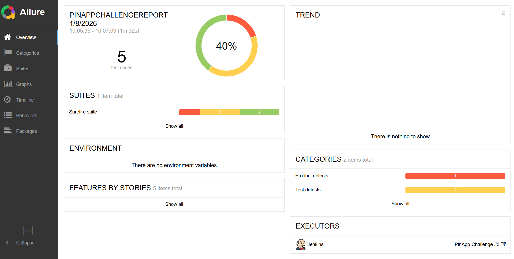
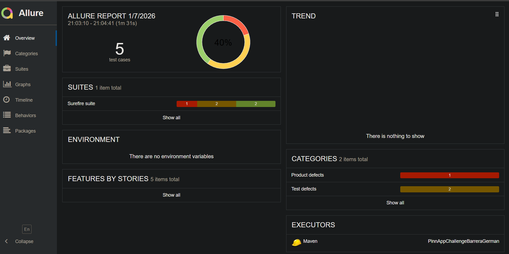

# PinApp Automation Challenge – German Barrera

End-to-end automation framework demonstrating API, Web, and Mobile testing
with professional architecture and CI-ready tooling.

---

##  Tech Stack

- **Java 21**
- **Maven**
- **TestNG**
- **Selenium (Web UI)**
- **Appium 2 (Mobile Android)**
- **RestAssured (API)**
- **Log4j2 (Logging)**
- **Allure Reports**
- **Jenkins Ready**

---

##  Test Strategy

This project validates a real end-to-end flow using Trello as the system under test:


### ✔ API
- Board creation using Trello public API.
- Validations on response and mapping using POJOs.

### ✔ Web
- Selenium with Page Object Model.
- Explicit waits and stable locators.
- Validation of board presence.

### ✔ Mobile
- Appium 2 with AndroidDriver.
- PageFactory and UiScrollable for dynamic scrolling.
- Validation of board presence inside the mobile app.
---
## 📊 Jenkins configured with Allure

---

## 📊 Allure Report

Below is an example of the generated Allure report after executing the tests:


---

## ▶️ How to Run

### Run all tests

```bash
mvn clean test "-DsuiteXmlFile=testng.xml"

